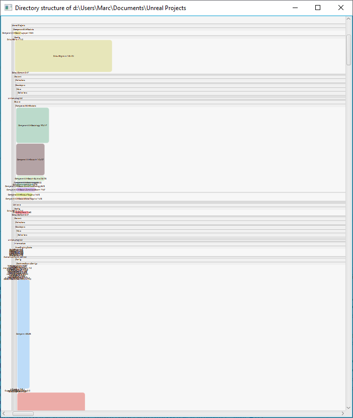

# Nested FlowPanes in Java

playing around with nested `FlowPane`s in Java

## V 0.1: two statically nested FlowPanes

[91b8cc214d73975742ca01a9ada3eb9ee1fddd99](https://github.com/MoooDob/NestedJavaFlowPanes/commit/91b8cc214d73975742ca01a9ada3eb9ee1fddd99)




The Panes are randomly created. The maximal height (`setPrefWrapLength`), the number of child panes and the background color of the parent pane can be set. The panes without child panes will be tinted in a random color. All items will be display from top to bottom in column-first order.

The window is scrollable, resizable and pannable. The created panes wont be resized if the window is resized.

## V 0.2: randomly created structures of nested FlowPanes


This time the structure is created randomly. You can control the structure by changing the following parameters:

```java
int maxNestingDepth = 10;
int maxNumberOfPanes = 30;
int maxNumberOfChilds = 3;
int seed = 1534;
```

`maxNumberOfPanes` declares the number of simple panes per nesting level (without child panes). In the last version, only the *leaf* panes will be colorized, all *branching* panes get only a black border. You can change this behavior by uncommenting the line `flowPane.setStyle`.

In each flow pane the items are sorted by number. Their height and size is randomly calculated. The maximal height of a pane is the maximum out of the height of the squared area of all child panes (child flow pane too) and the height of the highest child pane (child flow panes too), 

## V 0.3 Nested structure from directory structure


This version uses the structure of a directory and its subdirectories to create the nested flowpane structure. The height and the width of the panes representing the files are the lines of code (LOC) and the maximum length of all lines of this file. 

The presentation can be tweaked with the following variables:

```java
float transformFactor = 1.0f;
int seed = 1534;
```

The transformation factor controls if the created boxes are wider, longer or squared. A factor of 0 tries to create squared boxes (if possible), a factor greater 1 creates longer boxes and a factor smaller than 1 creates wider boxes.

The seed simply controls the color of the panes.

You can zoom the content with the mouse wheel.

## V 0.4 Simple vertical layout


Now it is possible to define if the files should be shown, if the borders should be shown, if a padding around the `FlowPane`s should be used or the size of the gap: 

```java
boolean showFiles = false;
boolean showBorder = false;
boolean usePadding = false;
int gap = 3;
```
This version aligns all node strait top down. 

## V 0.4b Simple Vertical Layout with configurable file size 


While version 0.4a only provides a fixed file size presentation, in this version the file size is configurable:

```java
boolean useFixedFileSize = false;
```

## V 0.5 Vertical layouted file structure


This version is a mixture of the previous versions: the file and directories are block-wise layouted. In each block the items (single files or sub blocks) are ordered by alphabet. The items are printed in rows first and the they are promoted to the columns. The height of a block is determined by the total height of items (single files or sub blocks), the maximum height of all these items and the height of the squared area of all items like in version 0.2. This is the formula:

```pseudocode
areaHeight = Math.sqrt(totalArea) * transformFactor;
prefBlockHeight = Math.max(areaHeight, maxPaneHeight);
prefBlockHeight = Math.min(totalPanesHeight, areaHeight);
prefBlockHeight += (# items - 1) * gap  	
```
You can colorize the background of the directories by turning the `showRandomDirectoryBackgroundColor` switch on.

## V 0.5b Area calculation added

The total and the used area of each directory will be calculated and exported to the file *areas.csv*. It's interesting to determine the ratio of empty space in the presentation.

This version provides a filter for file extensions and a filter for the files, that should be presented in max. line size / lines semantic:

```java
// Files with this extension will be shown, null or empty array => all files 
final String[] fileExtensionFilter = {}; // {"java", "cpp", "h"} // null /*=> all*/

// files with this extension will shown using their dimension (max line length x lines),
// other files will be shown using an equal sized rounded rectangle
// null or empty array => show all files with dimensions
final String[] dimensionDisplayExtensionFilter = {}; // {"java"}

// files with this file name will be explicitly shown using their dimension 
// (max line length x lines)
final String[] dimensionDisplayFilenameFilter = {}; // {"readme.md"}
```

If you use a none existing extension in the `dimensionDisplayExtensionFilter` all files will be shown with default dimensions like shown in the next figure.


These lines define the default size of the files. If you change the paneWidth for instance to 12 you get circles (squares with rounded corners) for each file. The presentation will be more compact.

```java
paneHeight = 12;
paneWidth = 12; 
```


Both presentations have the disadvantage of being less meaningful for getting an impression of the size of the system components.